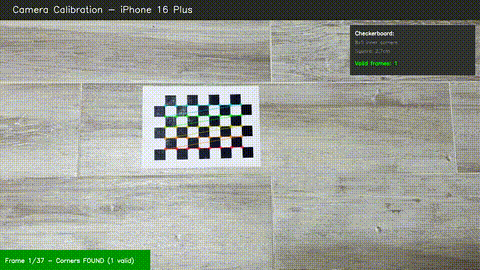
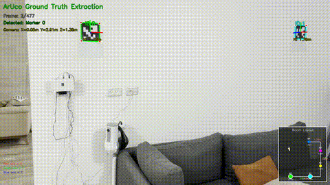
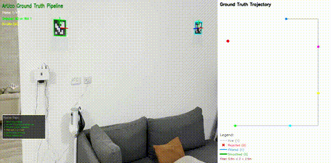
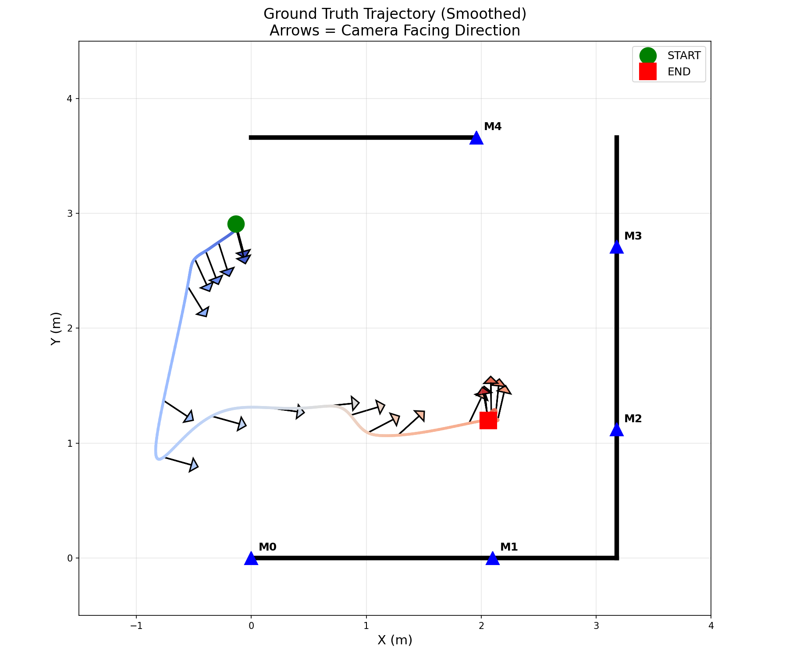
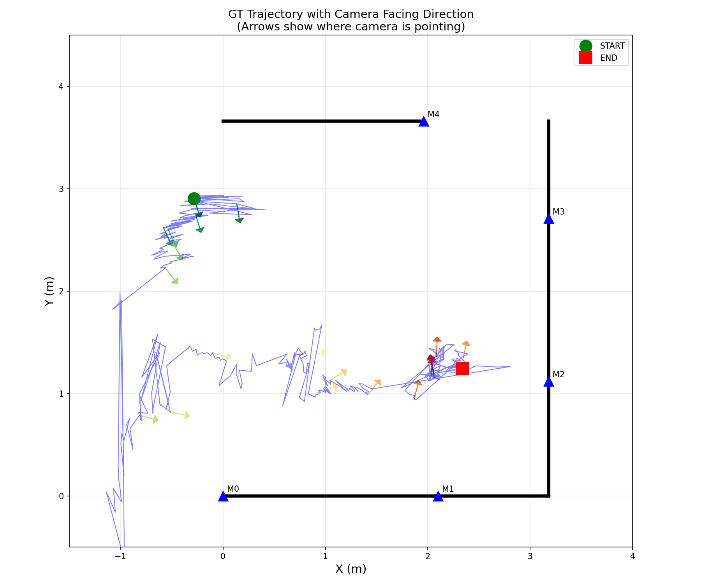
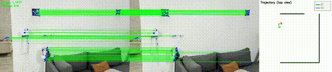
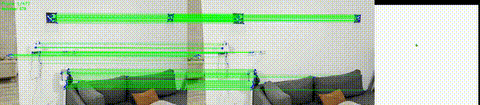
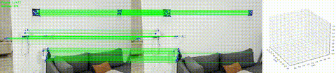

# Visual Odometry - 2-Frame Pose Estimation

[](https://github.com/salah-dev-stu/visual-odometry/actions/workflows/build.yml) (builds `vo_submission`)

Estimates relative camera pose (6DOF) between two images. Two frontends are available:

- **`vo_submission`** — Classical pipeline using ORB features + brute-force matching
- **`vo_neural`** — Neural pipeline using SuperPoint + LightGlue via ONNX Runtime (optional GPU)

Both share the same geometry backend (E/H selection, pure rotation detection, USAC_MAGSAC).

## How It Works

1. **Feature Detection & Matching**:
   - *Classical*: ORB features with brute-force Hamming matching, ratio test, and cross-check
   - *Neural*: SuperPoint keypoint extraction + LightGlue attention-based matching (ONNX)
2. **Pose Estimation**:
   - With calibration: Smart selection between Essential matrix (3D scenes) and Homography (planar scenes)
   - Without calibration: Auto-focal estimation using CVPR 2024 iterative method from PoseLib
   - Pure rotation detection: When camera rotates without translation, outputs rotation-only pose
3. **Validation**: Triangulation with cheirality and reprojection error checks

For detailed algorithm documentation, see [ALGORITHM.md](ALGORITHM.md).

## Demos

The trajectory visualizations and demo videos below were created with separate Python scripts that call the VO binary on consecutive frame pairs and accumulate the poses.

**Camera Calibration**

Camera intrinsic calibration using an 8x5 checkerboard pattern. Extracts focal length (fx, fy) and principal point (cx, cy) from multiple views.



**ArUco Marker Detection**

Detecting ArUco markers (6x6 dictionary) to establish ground truth camera positions. The minimap (bottom-right) shows real-time camera location within the room layout as markers are detected.



**Ground Truth Pipeline**

Shows how the ground truth trajectory was corrected and spikes were removed through filtering and smoothing.



Results:

| Smoothed Trajectory | Raw Trajectory with Heading |
|:---:|:---:|
|  |  |

**VO vs Ground Truth Comparison**

Top-down view comparing VO trajectory (blue) against ground truth (green) on the custom dataset.



Same comparison in 3D with rotating view (Pangolin visualization).



**TUM fr1/360 - Full Rotation 3D Trajectory**

Full 360° rotation from TUM dataset. VO trajectory shows direction errors and drift - expected limitations of 2-frame monocular VO without loop closure or bundle adjustment.


**Dataset Evaluation**

VO tested on 4 datasets: TUM RGB-D, ICL-NUIM, AGZ Zurich, and custom ArUco dataset. 2D trajectory comparisons show VO (blue) vs ground truth (green). Same limitations apply - drift and direction errors without loop closure or bundle adjustment.


**Matplotlib Visualization**

Same custom dataset comparison as above, using Matplotlib instead of Pangolin for 3D visualization.



## Output Format

The program outputs 4 lines:
```
R11 R12 R13
R21 R22 R23
R31 R32 R33
tx ty tz
```

- **Lines 1-3**: Rotation matrix (3x3)
- **Line 4**: Translation vector (unit length, scale is unknown in monocular VO)

### Example Output
```
0.999874 -0.007614 0.013932
0.008056 0.999458 -0.031921
-0.013681 0.032029 0.999393
-0.227991 -0.041450 0.972781
```

## Embedded Deployment (Yocto Linux)

The classical ORB pipeline (`vo_submission`) was deployed and tested on a **Raspberry Pi 4 Model B** running a custom **Yocto Linux** image. The neural frontend is not used here — it requires ONNX Runtime which is not available on the embedded target.

**Demo: VO running on Raspberry Pi 4**

Proof of execution on embedded hardware. The ORB binary runs on a custom Yocto Linux image with OpenCV and Eigen.


### Target Platform
- **Hardware**: Raspberry Pi 4 Model B (2GB RAM)
- **OS**: Yocto Linux (custom embedded image)
- **Architecture**: ARM64 (aarch64)

### Cross-Compilation Setup

The binary was cross-compiled from an x86_64 host using the `aarch64-linux-gnu` toolchain. Requires a cross-compilation sysroot with ARM64 OpenCV and Eigen libraries.

```bash
# Cross-compile for Raspberry Pi 4 (requires ARM64 sysroot)
aarch64-linux-gnu-g++ -O3 -std=c++17 -march=armv8-a+simd \
    -o vo_submission_arm64 src/vo_submission.cpp \
    -I poselib_src -I poselib_src/build/generated_headers \
    poselib_src/build/PoseLib/libPoseLib.a \
    $(pkg-config --cflags --libs opencv4 eigen3)
```

### Yocto Image Requirements

The Yocto image must include:
- OpenCV 4.x (`opencv`)
- Eigen3 (`libeigen`)
- Standard C++ runtime

### Deployment

```bash
# Copy binary to Pi
scp vo_submission_arm64 root@<pi-ip>:~/

# Run on Pi
ssh root@<pi-ip>
./vo_submission_arm64 image1.jpg image2.jpg -f 525.0
```

## Requirements

- OpenCV 4.x
- Eigen3
- PoseLib (cloned during build)
- C++17 compiler
- ONNX Runtime 1.17+ (optional, for `vo_neural`)
- NVIDIA GPU + cuDNN 8 (optional, for GPU-accelerated neural inference)

## Build Instructions

The standard build produces `vo_submission` (ORB). The neural binary `vo_neural` is optional and only built when ONNX Runtime is detected (see the optional step in the Linux section).

### Linux (Ubuntu/Debian) ✓ Tested

```bash
# Install dependencies
sudo apt-get update
sudo apt-get install -y build-essential cmake libopencv-dev libeigen3-dev

# Clone repository
git clone https://github.com/salah-dev-stu/visual-odometry.git
cd visual-odometry

# Clone and build PoseLib
git clone https://github.com/PoseLib/PoseLib.git poselib_src
cd poselib_src && mkdir -p build && cd build
cmake .. -DCMAKE_BUILD_TYPE=Release
make -j$(nproc)
cd ../..

# (Optional) Download ONNX models and runtime for neural VO
bash scripts/download_models.sh        # CPU only
bash scripts/download_models.sh --gpu  # With GPU support

# Build with CMake
mkdir -p build && cd build
cmake ..
make -j$(nproc)
```

The build system auto-detects ONNX Runtime. If found in `onnxruntime/`, `vo_neural` is built alongside `vo_submission`. If ONNX Runtime includes CUDA provider libraries, GPU acceleration is enabled automatically.

### macOS ✓ Tested

```bash
# Install dependencies
brew install opencv eigen

# Clone repository
git clone https://github.com/salah-dev-stu/visual-odometry.git
cd visual-odometry

# Clone and build PoseLib
git clone https://github.com/PoseLib/PoseLib.git poselib_src
cd poselib_src && mkdir -p build && cd build
cmake .. -DCMAKE_BUILD_TYPE=Release -DEIGEN3_INCLUDE_DIR=$(brew --prefix eigen)/include/eigen3
make -j$(sysctl -n hw.ncpu)
cd ../..

# Build with CMake
mkdir -p build && cd build
cmake .. -DEIGEN3_INCLUDE_DIR=$(brew --prefix eigen)/include/eigen3
make -j$(sysctl -n hw.ncpu)
```

### Windows ✓ Tested

**Prerequisites**: Visual Studio 2019/2022 or MSVC Build Tools

```powershell
# Install OpenCV via Chocolatey (run as Administrator)
choco install opencv -y

# Download and install Eigen
Invoke-WebRequest -Uri "https://gitlab.com/libeigen/eigen/-/archive/3.4.0/eigen-3.4.0.zip" -OutFile eigen.zip
Expand-Archive eigen.zip -DestinationPath .
mkdir eigen3_install
cd eigen-3.4.0
mkdir build && cd build
cmake .. -DCMAKE_INSTALL_PREFIX="$PWD/../../eigen3_install"
cmake --install .
cd ../..

# Clone repository
git clone https://github.com/salah-dev-stu/visual-odometry.git
cd visual-odometry

# Clone and build PoseLib
git clone https://github.com/PoseLib/PoseLib.git poselib_src
cd poselib_src
mkdir build && cd build
cmake .. -DCMAKE_BUILD_TYPE=Release -DCMAKE_PREFIX_PATH="$PWD/../../eigen3_install"
cmake --build . --config Release
cd ../..

# Build with CMake
# Note: OpenCV_DIR path depends on your installation. Common locations:
#   Chocolatey: C:/tools/opencv/build
#   Manual install: C:/opencv/build
mkdir build && cd build
cmake .. -DOpenCV_DIR="C:/tools/opencv/build" -DCMAKE_PREFIX_PATH="$PWD/../eigen3_install"
cmake --build . --config Release

# Binary will be at: build/Release/vo_submission.exe
```

### Alternative: Direct Compilation (Linux/macOS)

```bash
g++ -O3 -std=c++17 -o vo_submission src/vo_submission.cpp \
    -I poselib_src -I poselib_src/build/generated_headers \
    poselib_src/build/PoseLib/libPoseLib.a \
    $(pkg-config --cflags --libs opencv4 eigen3)
```

## Usage

### Classical (ORB)

```bash
./vo_submission <image1> <image2> [options]
```

| Flag | Description | Default |
|------|-------------|---------|
| `-f <focal>` | Focal length in pixels (assumes fx=fy, cx=w/2, cy=h/2) | Auto-estimate |
| `-k <fx,fy,cx,cy>` | Full camera intrinsics matrix | None |
| `-s <scale>` | Image scale factor (0.25, 0.5, 1.0) | Auto (1.0 for auto-focal, 0.5 for known) |
| `-m <file>` | Output matched points to file (for visualization) | None |
| `-d` | Debug output (prints selection metrics to stderr) | Off |

### Neural (SuperPoint + LightGlue)

```bash
./vo_neural <image1> <image2> [options]
```

| Flag | Description | Default |
|------|-------------|---------|
| `-f <focal>` | Focal length in pixels | Auto-estimate |
| `-k <fx,fy,cx,cy>` | Full camera intrinsics matrix | None |
| `-M <models_dir>` | Path to ONNX models directory | `models/` |
| `-d` | Debug output | Off |

Both binaries produce identical output format (3x3 rotation matrix + translation vector).

### Examples

```bash
# Classical VO - auto focal estimation
./vo_submission frame001.jpg frame002.jpg

# Classical VO - with full calibration
./vo_submission frame001.jpg frame002.jpg -k 517.3,516.5,318.6,255.3

# Neural VO - with calibration
./vo_neural frame001.jpg frame002.jpg -k 517.3,516.5,318.6,255.3

# Neural VO - custom model directory
./vo_neural frame001.jpg frame002.jpg -k 517.3,516.5,318.6,255.3 -M /path/to/models
```

### Benchmark Comparison (ORB vs Neural)

Evaluated on three datasets with known ground truth:

| Dataset | Frontend | Rotation Error (mean) | Translation Error (mean) | Trans < 30° |
|---------|----------|-----------------------|--------------------------|-------------|
| TUM fr1/xyz | ORB | 5.79° | 28.23° | 56.8% |
| TUM fr1/xyz | Neural | 5.66° | 13.94° | 87.5% |
| AGZ Zurich | ORB | 2.63° | 39.08° | 34.0% |
| AGZ Zurich | Neural | 2.10° | 25.03° | 79.0% |
| Custom (ArUco) | ORB | 1.26° | 34.05° | 42.0% |
| Custom (ArUco) | Neural | 1.11° | 38.97° | 37.7% |

Neural matching improves translation accuracy on most datasets due to higher-quality correspondences. The custom dataset is an exception — its small baseline motions expose degenerate geometry that affects both frontends.

### Performance (Raspberry Pi 4)

Benchmarked with 640x480 VGA images (ORB only — neural requires ONNX Runtime):

| Mode | Time | Use Case |
|------|------|----------|
| Auto focal (no flags) | ~0.70s | Default, no calibration needed |
| Known focal, scale=0.5 | ~0.32s | When calibration known |
| Known focal, scale=1.0 | ~0.48s | High precision |
| Known focal, scale=0.25 | ~0.25s | Real-time embedded |

## Acknowledgments

This project was developed with assistance from [Claude Code](https://claude.ai/code) AI.
